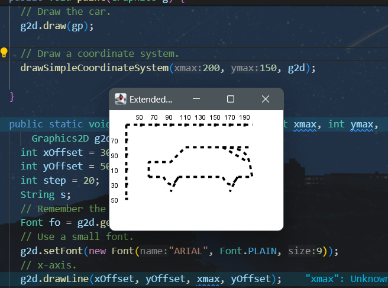

Devit Erlingga Arafiudin
1201220030

## 3.1 Derive the midpoint algorithm for drawing lines with a slope between −1 and 0.

## 3.2 Apply the structural algorithm in section 3.3 to draw the line in figure 3.6.
- Tentukan titik ujung garis, (x0, y0) dan (x1, y1).
- Hitung perbedaan antara koordinat x dan y, dx = x1 - x0 dan dy = y1 - y0.
- Hitung nilai kemiringan rasional garis, yaitu dy/dx.
- Gunakan persamaan garis: y = m * x + b untuk menentukan nilai b.
- Mulai dari titik awal (x0, y0), langkah-langkahnya adalah sebagai berikut: 
- a. Hitung nilai variabel keputusan (D) berdasarkan algoritma midpoint. 
- b. Pilih piksel berikutnya yang akan digambar berdasarkan nilai D. 
- c. Perbarui posisi piksel dan nilai D, dan ulangi langkah tadi hingga mencapai titik akhir (x1, y1).
- Dengan mengurangi operasi pada piksel yang akan digambar dan menghindari operasi pecahan, komputasi dapat dilakukan dengan menggunakan bilangan bulat saja.
- Dengan memanfaatkan pendekatan ini, garis dapat digambar menggunakan algoritma struktural dengan langkah-langkah yang telah diuraikan sebelumnya.

## 3.3 Extend the program GeneralPathCar.java for drawing the car of figure 2.10.
- Show the control points for the quadratic and cubic curves.
- Connect the endings of the curves with their corresponding control points by dashed lines.

